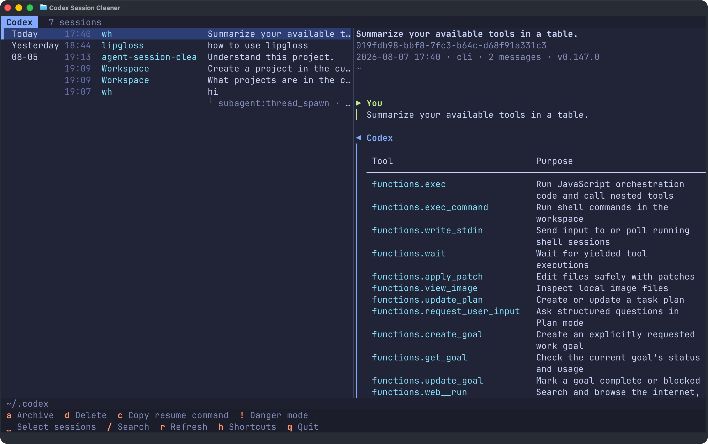

<div align="center">
  <h1>agent-session-cleaner</h1>
  <p><strong>Browse, resume, and clean up all your Codex, Claude Code, OpenCode, and Pi sessions from one terminal.</strong></p>
  <p>
    <a href="https://github.com/haowang02/agent-session-cleaner/releases/latest"></a>
    <a href="https://github.com/haowang02/agent-session-cleaner/actions/workflows/ci.yml"></a>
    
    <a href="./LICENSE"></a>
  </p>
  <p><strong>English</strong> · <a href="./README.zh-CN.md">简体中文</a></p>
</div>



## Install

Install or update on macOS and Linux:

```bash
curl -LsSf https://raw.githubusercontent.com/haowang02/agent-session-cleaner/main/install.sh | sh
```

Install or update on Windows from PowerShell:

```powershell
powershell -ExecutionPolicy Bypass -c "irm https://raw.githubusercontent.com/haowang02/agent-session-cleaner/main/install.ps1 | iex"
```

The Windows installer adds `%LOCALAPPDATA%\Programs\agent-session-cleaner\bin` to your user `PATH`. Open a new terminal after the first install.

## Usage

```bash
asc
# The full command name agent-session-cleaner is also available.
```

Run without arguments to choose an agent, or name one directly:

```bash
asc codex
asc claude
asc opencode
asc pi
```

By default, the app uses `$CODEX_HOME` or `~/.codex` for Codex, `$CLAUDE_CONFIG_DIR` or `~/.claude` for Claude Code, `$XDG_DATA_HOME/opencode` or `~/.local/share/opencode` for OpenCode, and `$PI_CODING_AGENT_DIR` or `~/.pi/agent` for Pi. On Windows, `~` is your user profile directory. To override a location explicitly:

```bash
asc --codex-home /path/to/codex
asc --claude-home /path/to/claude
asc --opencode-home /path/to/opencode
asc --pi-home /path/to/pi/agent
```

The OpenCode path must name the `opencode` data directory itself, not its parent. The `opencode.db` file, when present, lives directly inside it.

Session discovery and previews read the stored data directly. Codex changes and OpenCode deletions require their respective CLIs; if a CLI is unavailable, that agent opens in browse-only mode. Claude Code and Pi deletions operate directly on their session files.

### Language

The interface follows your locale (`LC_ALL`, `LC_MESSAGES`, `LANGUAGE`, or `LANG`). Chinese locales use Simplified Chinese; all other locales use English. To override detection:

```bash
ASC_LANG=en asc
ASC_LANG=zh-CN asc
```

In PowerShell, use `$env:ASC_LANG = "zh-CN"` before running `asc`.

## Keyboard shortcuts

The footer shows the shortcuts available for the current agent and installation. Press `h` for the complete in-app reference.

| Key | Action | Supported by |
|---|---|---|
| `↑` `↓` / `j` `k` | Move to the previous / next session | All agents |
| `g` / `G` | Jump to the top / bottom of the list | All agents |
| `Tab` | Switch between the session list and conversation | All agents |
| `␣` | Select or deselect the current session | All agents |
| `/` | Search titles, working directories, session IDs, and clients | All agents |
| `?` | Search backward | All agents |
| `n` / `N` | Jump to the next / previous match | All agents |
| `c` | Copy the current session ID | All agents |
| `y` | Copy the current session's working directory | All agents |
| `d` | Delete the current session or selected sessions | All agents |
| `a` | Archive the current session or selected sessions | Codex only |
| `u` | Unarchive the current session or selected sessions | Codex only |
| `D` | Delete all archived sessions | Codex only |
| `O` | Delete all orphaned sub-agent sessions | Codex and OpenCode |
| `E` | Delete all empty sessions | Claude Code only |
| `r` | Refresh the session list | All agents |
| `h` | Show keyboard shortcuts | All agents |
| `!` | Toggle danger mode; individual deletions skip confirmation | All agents |
| `Esc` | Exit multi-select, turn off danger mode, or clear the search | All agents |
| `q` | Quit | All agents |

Press Space or double-click to select or deselect a session. Selecting a session includes all of its descendant sub-agent sessions. Actions supported by the current agent apply to every selected session; press `Esc` to clear the selection.

## Resume a session

To resume the current session, press `c` to copy its ID, then paste it into the corresponding agent command:

```bash
codex resume <session-id>
claude --resume <session-id>
opencode -s <session-id>
pi --session <session-id>
```

## Deletion and archiving

> [!WARNING]
> This tool does not create backups. Deleted sessions cannot be recovered.

- Deleting or archiving a session also includes its descendant sub-agent sessions.
- Codex archive, unarchive, and delete operations are delegated to the Codex CLI.
- Claude Code deletion removes the transcript and its related session data directly.
- OpenCode deletion is delegated to the OpenCode CLI.
- Pi deletion removes the session file directly.
- In danger mode (`!`), individual deletions skip confirmation. Bulk deletion still asks for confirmation.

## Acknowledgements

- [LINUX DO](https://linux.do/) — a community for builders and curious minds
