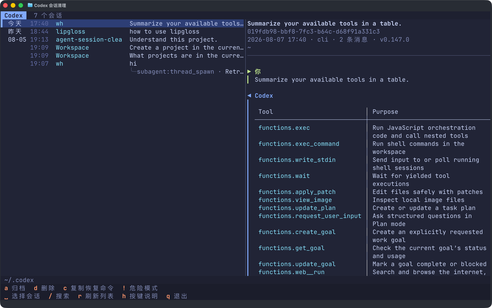

<div align="center">
  <h1>agent-session-cleaner</h1>
  <p><strong>在一个终端中浏览、恢复和清理 Codex、Claude Code、OpenCode 与 Pi 的全部会话。</strong></p>
  <p>
    <a href="https://github.com/haowang02/agent-session-cleaner/releases/latest"></a>
    <a href="https://github.com/haowang02/agent-session-cleaner/actions/workflows/ci.yml"></a>
    
    <a href="./LICENSE"></a>
  </p>
  <p><a href="./README.md">English</a> · <strong>简体中文</strong></p>
</div>



## 安装

在 macOS 和 Linux 上安装或更新：

```bash
curl -LsSf https://raw.githubusercontent.com/haowang02/agent-session-cleaner/main/install.sh | sh
```

在 Windows PowerShell 中安装或更新：

```powershell
powershell -ExecutionPolicy Bypass -c "irm https://raw.githubusercontent.com/haowang02/agent-session-cleaner/main/install.ps1 | iex"
```

Windows 安装脚本会将程序安装到 `%LOCALAPPDATA%\Programs\agent-session-cleaner\bin`，并把该目录加入用户 `PATH`。首次安装后请打开一个新终端。

## 使用

```bash
asc
# 也可以使用完整命令名 agent-session-cleaner。
```

不带参数运行时，可在启动界面选择 Agent；也可以在命令中直接指定：

```bash
asc codex
asc claude
asc opencode
asc pi
```

默认情况下，Codex 使用 `$CODEX_HOME` 或 `~/.codex`，Claude Code 使用 `$CLAUDE_CONFIG_DIR` 或 `~/.claude`，OpenCode 使用 `$XDG_DATA_HOME/opencode` 或 `~/.local/share/opencode`，Pi 使用 `$PI_CODING_AGENT_DIR` 或 `~/.pi/agent`。在 Windows 上，`~` 表示当前用户的配置文件目录。如需明确指定其他目录：

```bash
asc --codex-home /path/to/codex
asc --claude-home /path/to/claude
asc --opencode-home /path/to/opencode
asc --pi-home /path/to/pi/agent
```

OpenCode 路径必须指向名为 `opencode` 的数据目录本身，而不是它的上级目录；`opencode.db` 存在时会直接位于该目录中。

会话列表和对话预览会直接读取已有数据。修改 Codex 会话和删除 OpenCode 会话需要相应的 CLI；CLI 不可用时，仍可进入该 Agent 的只读浏览模式。Claude Code 和 Pi 的删除操作会直接作用于各自的会话文件。

### 语言

界面会跟随系统 locale（`LC_ALL`、`LC_MESSAGES`、`LANGUAGE` 或 `LANG`）：中文 locale 显示简体中文，其他语言显示英文。如需覆盖自动检测：

```bash
ASC_LANG=en asc
ASC_LANG=zh-CN asc
```

在 PowerShell 中，可先执行 `$env:ASC_LANG = "zh-CN"`，再运行 `asc`。

## 快捷键

界面底部会列出当前 Agent 和本机环境可用的快捷键。按 `h` 可查看完整的快捷键说明。

| 键 | 作用 | 支持范围 |
|---|---|---|
| `↑` `↓` / `j` `k` | 移到上一条 / 下一条会话 | 全部 Agent |
| `g` / `G` | 跳到列表顶部 / 底部 | 全部 Agent |
| `Tab` | 在会话列表和对话详情之间切换 | 全部 Agent |
| `␣` | 选择或取消选择当前会话 | 全部 Agent |
| `/` | 搜索标题、工作目录、会话 ID 和客户端 | 全部 Agent |
| `?` | 反向搜索 | 全部 Agent |
| `n` / `N` | 下一个 / 上一个匹配项 | 全部 Agent |
| `c` | 复制当前会话的 ID | 全部 Agent |
| `y` | 复制当前会话的工作目录 | 全部 Agent |
| `d` | 删除当前会话或所有已选会话 | 全部 Agent |
| `a` | 归档当前会话或所有已选会话 | 仅 Codex |
| `u` | 取消归档当前会话或所有已选会话 | 仅 Codex |
| `D` | 删除所有已归档会话 | 仅 Codex |
| `O` | 删除所有孤立的子代理会话 | Codex 和 OpenCode |
| `E` | 删除所有空会话 | 仅 Claude Code |
| `r` | 刷新会话列表 | 全部 Agent |
| `h` | 按键说明 | 全部 Agent |
| `!` | 开启或关闭危险模式；删除单个会话时跳过确认 | 全部 Agent |
| `Esc` | 退出多选模式、关闭危险模式，或清除搜索 | 全部 Agent |
| `q` | 退出 | 全部 Agent |

按空格键或双击即可选择或取消选择会话。选择一条会话时，它派生的所有子代理会话也会一并选中。当前 Agent 支持的操作会应用到全部已选会话；按 `Esc` 可清除选择。

## 恢复会话

如需恢复当前会话，按 `c` 复制其 ID，然后将其粘贴到对应 Agent 的命令中：

```bash
codex resume <session-id>
claude --resume <session-id>
opencode -s <session-id>
pi --session <session-id>
```

## 删除与归档

> [!WARNING]
> 本工具不会创建备份，删除的会话无法恢复。

- 删除或归档一条会话时，它派生的子代理会话也会一并处理。
- Codex 的归档、取消归档和删除操作会交由 Codex CLI 执行。
- Claude Code 会直接删除会话记录及其相关数据。
- OpenCode 的删除操作会交由 OpenCode CLI 执行。
- Pi 会直接删除会话文件。
- 危险模式（`!`）下，删除单个会话时会跳过确认；批量删除仍会要求确认。

## 致谢

- [LINUX DO](https://linux.do/)——面向创造者与好奇者的社区
